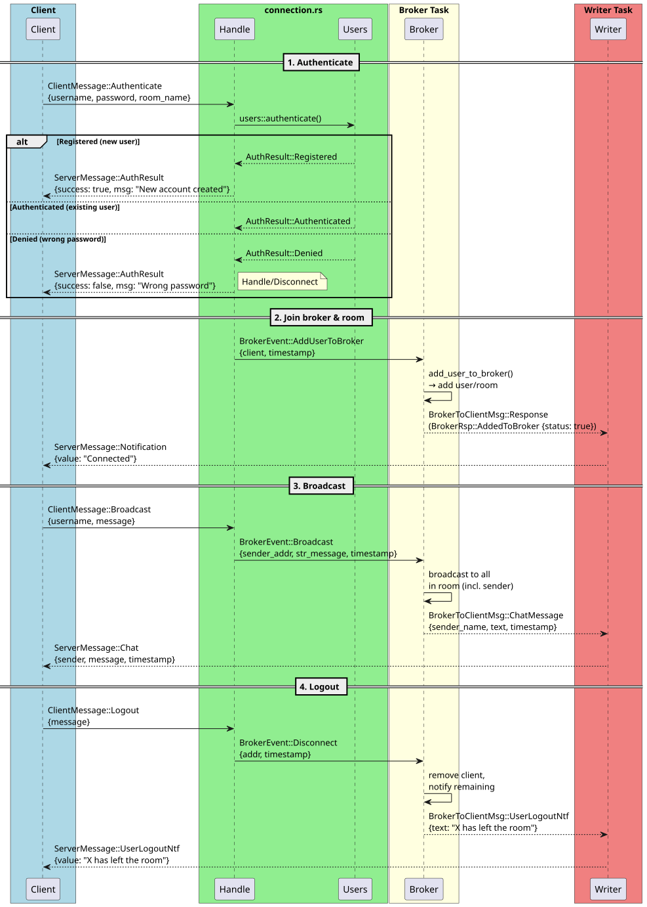

[](https://github.com/javierfileiv/chatter/actions/workflows/rust-ci.yml)
[](https://javierfileiv.github.io/chatter/)

# Chatter

A real-time chat application built with Rust, using WebSocket for client-server communication and a broker-based message routing architecture.

> **Note:** The client TUI was initially based on [rust-retro-chat](https://github.com/BekBrace/rust-retro-chat) by BekBrace, and has been significantly modified and extended for this project.

## Features

- WebSocket-based real-time messaging
- Multi-room support via a central message broker
- **Client TUI** built with [Cursive](https://github.com/gyscos/cursive) — retro terminal theme
- Client commands: `/help`, `/clear`, `/connect`, `/debug`, `/quit`
- Toggleable debug log panel (`/debug`) powered by flexi_logger
- Live clock in the header UI (updates every second)
- WebSocket connection with authentication handshake (timeout + error handling)
- Bi-directional message sending: send messages to server and display broadcasted messages
- Connection status and room display in footer
- Logout notification on `/quit`
- Server-side timestamps on all chat messages and notifications
- User authentication — new users are auto-registered, returning users must match password
- Disconnect notifications — remaining room members are notified when a client leaves
- Graceful and abrupt disconnect handling with automatic cleanup
- Async I/O with Tokio

## Project Structure

```
chatter/
├── client/                     # Terminal client crate (Cursive TUI)
│   ├── src/main.rs             #   Entrypoint, CLI args, Context struct, flexi_logger init
│   ├── src/commands.rs         #   Slash commands: /help, /clear, /connect, /debug, /quit
│   ├── src/network.rs          #   WebSocket connection: connect, auth, reader/writer loops
│   ├── src/theme.rs            #   Retro terminal color theme
│   ├── src/ui.rs               #   TUI assembly, clock refresh callback, logger setup
│   ├── src/ui/
│   │   ├── dialogs.rs          #   Connect dialog, notification, message/input helpers
│   │   ├── layout.rs           #   Layout: header, messages, input, footer, logger panel
│   │   └── status.rs           #   Connection status + room display
│   └── Cargo.toml              #   edition = "2021", cursive, clap, chrono, tokio
├── common/                     # Shared library crate
│   ├── src/lib.rs              #   Re-exports errors and ws_messages
│   ├── src/ws_messages.rs      #   Serde structs: AuthenticateUser, SendMessage, Logout
│   └── Cargo.toml              #   edition = "2021"
├── server/                     # Server crate
│   ├── src/main.rs             #   Tokio entrypoint, CLI args (port, log-dir)
│   ├── src/auth.rs             #   Auth module root
│   ├── src/auth/users.rs       #   Argon2 password hashing + auto-register
│   ├── src/core.rs             #   Core module root
│   ├── src/core/server.rs      #   Accept loop, spawns per-connection tasks
│   ├── src/core/broker.rs      #   Central event loop: rooms, clients, routing
│   ├── src/core/connection.rs  #   Per-connection WebSocket handler, pure parsing functions
│   ├── src/core/connection/    #   Connection module extras
│   │   └── connection_tests.rs #   Unit tests for parse functions, ws_half_reader, and ws_half_writer
│   └── Cargo.toml              #   edition = "2021"
├── tests/                      # Python integration tests
│   ├── conftest.py             #   Pytest fixtures
│   └── test_integration.py     #   End-to-end WebSocket tests
├── scripts/                    # Helper scripts
│   ├── test_integration.sh     #   Builds server, runs pytest, cleans up
│   └── gen_coverage.sh         #   Generates coverage report (text + HTML)
├── .github/workflows/          # CI workflows
│   ├── rust-ci.yml             #   Build, test, fmt, clippy
│   ├── coverage.yml            #   Coverage report + GitHub Pages deploy
│   └── integration.yml         #   Python integration tests
├── Cargo.toml                  # Workspace manifest (3 members)
├── Cargo.lock
├── Dockerfile                  # Multi-stage Docker build (server only)
├── docker-compose.yml          # Docker Compose for server
├── .dockerignore               # Files excluded from Docker context
├── .pre-commit-config.yaml     # fmt + clippy hooks
├── tools/requirements.txt      # pre-commit (Python)
├── docs/
│   └── messages.plantuml       # Message sequence diagram source
│   └── messages.svg            # Rendered SVG diagram
```

## Architecture

```
client ──WebSocket──▶ server::core::server (accept loop)
                          │
                          ▼
                    server::core::connection (per-connection task)
                          │  authenticate (auto-register if new user)
                          │  read incoming frames
                          ▼
                    server::core::broker (central event loop)
                          │  manages rooms & clients
                          │  routes AddUserToBroker / Broadcast / JoinRoom events
                          ▼
                    BrokerToClientMsg → back to connection → WebSocket → client
```

```
client architecture (sync main thread):

  Cursive event loop ──▶ commands.rs ──▶ tx_msg (mpsc)
         │                                    │
         │                                    ▼
         │                            ws_half_writer ──▶ WebSocket
         │                                                       │
         │                                                       ▼
         │                            ws_half_reader ◀────── WebSocket
         │                                    │
         ▼                                    ▼
      cb_sink ◀────────── handle_incoming_server_msg
  (UI callbacks)
```

The client runs Cursive on the main thread (sync) while network I/O runs on a
tokio task (async). Two channels bridge the two worlds:

- **tx_msg** (`UnboundedSender<String>`) — commands.rs serializes `ClientMessage`
  as JSON and sends it to `ws_half_writer`, which forwards it over WebSocket
- **cb_sink** (`CbSink`) — the reader calls `handle_incoming_server_msg` which
  dispatches `ServerMessage` variants and pushes UI updates via Cursive's
  callback sink



### Auto-registration

The server stores credentials in an in-memory `HashMap`. When a client connects :

1. **New user** — username not in the map → credentials are stored and authentication succeeds
2. **Returning user** — username exists → password must match, otherwise authentication fails

Usernames are unique : two clients cannot share the same username.

No separate registration step is needed. The map is lost when the server restarts (no disk persistence).

| Crate | Role | Key Dependencies |
|-------|------|-----------------|
| `common` | Shared message types | `serde`, `serde_json`, `chrono` |
| `server` | WebSocket server + broker | `tokio` (full), `tokio-tungstenite`, `futures-util`, `flexi_logger`, `argon2`, `rand` |
| `client` | Terminal TUI client | `cursive`, `clap`, `chrono`, `tokio`, `tokio-tungstenite`, `futures-util`, `flexi_logger`, `cursive-flexi-logger-view` |

## Getting Started

### Prerequisites

- Rust stable toolchain (`rustup`)
- Python 3 (for pre-commit hooks)

### Build

```bash
cargo build --workspace
```

### Run the Server

```bash
# Default: 127.0.0.1:1234, logs in ./logs/
cargo run --bin server

# Custom port and log directory
cargo run --bin server -- --port 3000 --log-dir /tmp/my-logs
```

Logs are written to the specified directory (default: `logs/`) and echoed to stdout.

### Run with Docker

Build the image:

```bash
docker build -t chatter-server .
```

Run the server container (port 1234 exposed):

```bash
docker run -p 1234:1234 chatter-server
```

Or with Docker Compose:

```bash
docker compose up (add --build if code has been modified, otherwise cached image will be used)
```

### Testing with Docker

Once the server is running in Docker, you can test it with the client:

```bash
# Terminal 1: Start Docker server (if not already running)
docker run -d --name chatter -p 1234:1234 chatter-server

# Terminal 2: Connect with client
cargo run --bin client -- --user alice --pass secret --room test

# Test multiple clients in the same room
cargo run --bin client -- --user bob --pass secret --room test
cargo run --bin client -- --user charlie --pass secret --room test
```

Run integration tests against the Docker server:

```bash
source .venv/bin/activate
PORT=1234 pytest tests/ -v
```

Check server logs:

```bash
docker logs -f chatter
```

Cleanup:

```bash
docker stop chatter && docker rm chatter
```

### Run the Client

```bash
# Default: prompts for user, connects to 127.0.0.1:1234
cargo run --bin client

# With custom user and server
cargo run --bin client -- --user alice --port 3000
```

Cursive TUI with a retro terminal theme. Commands available in the chat:

| Command | Action |
|---------|--------|
| `/help` | Show available commands |
| `/clear` | Clear the message area |
| `/connect` | Open the server connection dialog |
| `/debug` | Toggle the debug log panel (flexi_logger output) |
| `/quit` | Exit the application |

**Note:** The TUI connects to the WebSocket backend upon `/connect`; auth, reader, and writer loops run in background Tokio tasks.

## Development

### Pre-commit Hooks

Install once after cloning:

```bash
pip install -r tools/requirements.txt
pre-commit install
```

Hooks run `cargo fmt --all` and `cargo clippy --all-targets --all-features -- -D warnings` on every commit.

### Format & Lint (CI-equivalent check)

```bash
cargo fmt --all && cargo clippy --all-targets --all-features -- -D warnings
```

### Tests

```bash
cargo test --all          # Run all tests
cargo test -p server      # Server crate only (includes broker + connection tests)
cargo test -p common      # Common crate only
```

### Integration Tests

Run the integration test script which builds the server, starts it on a free port, runs pytest, and cleans up:

```bash
./scripts/test_integration.sh
```

Requires: `pip install websockets pytest pytest-asyncio`

Tests cover: authentication, message broadcasting, room isolation, logout, and disconnect notifications.

### CI Workflows

Three GitHub Actions workflows run on push/PR to main/master:

- **rust-ci.yml** — builds, runs unit tests, checks formatting and clippy
- **coverage.yml** — generates coverage report, deploys HTML to GitHub Pages
- **integration.yml** — runs Python integration tests via `./scripts/test_integration.sh`

### Known Gaps

- **Persistence** — user database is stored in memory and lost when the server restarts.

## License

MIT — see [LICENSE](LICENSE).
